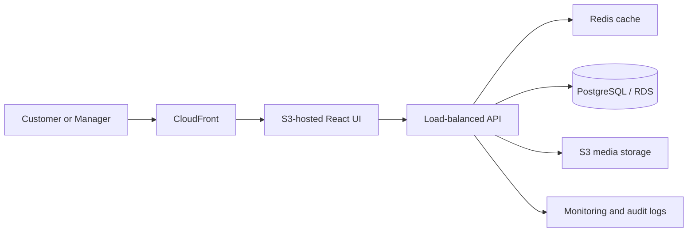

<div align="center">

# Root & Bloom Gardening Services


### 🌱 A customer-first garden-care and retail operations platform

Book a trusted gardener, shop garden essentials, and give managers the
information they need to keep daily operations moving.

</div>

<br />

| 👤 Customer portal | 🧭 Manager workspace | 💾 Persistent prototype data | 🧠 Business processing |
| --- | --- | --- | --- |
| Book, track and cancel services | Monitor jobs and stock | LocalStorage-backed records | Matching and reorder decisions |

Root & Bloom is a digital business information system for a gardening services
and retail business. It connects customers with gardening services and gives
managers an operational view of bookings, revenue and inventory.

This repository contains the working CIA III prototype for **Digital Business
Systems | ECD223-3**.

> **Project scope:** This repository contains a working academic prototype.
> Features described as planned or recommended are clearly separated from the
> implemented browser workflow.

## Contents

- [What the system demonstrates](#what-the-system-demonstrates)
- [Business logic](#business-logic)
- [Data model](#data-model)
- [Run locally](#run-locally)
- [Demonstration checklist](#demonstration-checklist)
- [Repository documentation](#repository-documentation)
- [Contribution workflow](#contribution-workflow)
- [Limitations and next steps](#project-limitations-and-next-steps)

## What the system demonstrates

The application follows the complete business flow:

```text
Customer input -> React application logic -> persistent LocalStorage data
					-> booking/order result -> customer or manager output
```

### At a glance

| Area | Implemented capability | Business value |
| --- | --- | --- |
| Customer experience | Booking, cart, checkout, history and progress timeline | Reduces friction from service discovery to confirmation |
| Operations | Booking status updates and inventory editing | Gives the manager a single operational view |
| Decision support | Gardener ranking and reorder recommendations | Converts records into useful business decisions |
| Data management | Eight related collections with persistent browser storage | Demonstrates collection, processing, storage and retrieval |

### Customer operations

- Select a customer identity and zone
- Book a gardening service for a future date
- Add booking notes and receive validation feedback
- View booking history, assigned gardener and booking status
- Cancel non-completed bookings
- Search the product catalogue by name or category
- Add products to a persistent cart
- Complete checkout with stock-aware validation
- View order history and transaction totals

### Manager operations

- Switch to the manager view
- Monitor revenue, pending bookings and average gardener rating
- Update booking statuses
- Delete business records when required
- Update product stock levels
- Identify low-stock products and recommended reorder quantities
- Add new products to the catalogue

### Service journey

```text
Choose service -> Select future date and zone -> Validate request
	-> Match available gardener -> Confirm booking -> Track progress
```

### Retail journey

```text
Search catalogue -> Add within available stock -> Calculate total
	-> Validate stock again -> Create order -> Reduce inventory -> Show history
```

## Business logic

The prototype includes two business-processing mechanisms rather than only
static screens:

1. **Gardener matching:** available gardeners are filtered by service
	specialization and workload, then ranked using rating, zone match and
	current workload.
2. **Inventory reorder recommendation:** products at or below their reorder
	point receive a recommended replenishment quantity.

The implementation and examples are documented in
[`docs/architecture.md`](docs/architecture.md). The relevant application logic
is in [`src/App.tsx`](src/App.tsx).

### Decision support in the dashboard

The customer view turns stored records into useful decisions and feedback:

- a booking receives a gardener assignment based on service fit, rating, zone
	and workload
- a booking timeline makes the operational status visible from request to
	completion
- the product view prevents customers from adding more than available stock
- the manager inventory view receives a reorder recommendation when stock is
	below its threshold

## Data model

The browser-backed prototype persists a structured business dataset containing
these entities:

| Entity | Purpose |
| --- | --- |
| Users | Customer and manager identities, roles and zones |
| Services | Gardening service catalogue and pricing |
| Gardeners | Staff specialization, rating and availability |
| Bookings | Customer requests, assignments, dates and statuses |
| Products | Retail catalogue, prices and stock |
| Orders | Customer transactions and order statuses |
| Order items | Products and quantities belonging to an order |
| Inventory | Stock, reorder points and update dates |

Data is persisted in the browser using the `root-bloom-cia3-data` key. The
shopping cart uses `root-bloom-cart`.

### Data-layer implementation

The active data boundary is [`src/lib/data-store.ts`](src/lib/data-store.ts).
It provides:

- safe JSON read and write operations
- generic create, update and delete functions for identified records
- reusable collection helpers instead of repeating storage logic in UI code
- validation at the inventory boundary so stock cannot become negative or use
	fractional values

The application uses this boundary for booking updates, booking deletion,
order creation, product stock updates and new product creation. This is the
Student C data-layer contribution and is recorded in the implementation log.

## Assessment evidence map

| CIA III requirement | Evidence in this repository |
| --- | --- |
| Two user roles | Customer View and Manager View in [`src/App.tsx`](src/App.tsx) |
| Three or more customer operations | Booking, product search/cart, checkout, history and cancellation |
| Three or more manager operations | Status updates, inventory editing, product creation and KPI monitoring |
| Persistent data | `root-bloom-cia3-data` and `root-bloom-cart` LocalStorage records |
| Six or more entities | Users, Services, Gardeners, Bookings, Products, Orders, Order items and Inventory |
| Business algorithm | Gardener priority scoring and inventory reorder recommendation |
| Live analytics | Booking pipeline, inventory health and customer care pulse charts |
| Architecture and scale | [`docs/architecture.md`](docs/architecture.md) |
| Work log and contribution evidence | [`docs/project-implementation.md`](docs/project-implementation.md) |

## Technology

- React 18
- TypeScript
- Vite
- CSS
- Browser LocalStorage for prototype persistence

The proposed production architecture, cloud deployment and million-user
scalability plan are documented in
[`docs/architecture.md`](docs/architecture.md).

## Run locally

Prerequisite: Node.js 18 or newer and npm.

From the repository root:

```bash
npm install
npm run dev
```

Open the local URL printed by Vite, normally `http://localhost:5173`.

For a production build:

```bash
npm run build
npm run preview
```

## Demonstration checklist

1. Open Customer View and select a customer.
2. Submit an empty booking to demonstrate validation.
3. Submit a valid future booking with a zone and notes.
4. Confirm the assigned gardener and booking status appear.
5. Search for a product and add it to the cart.
6. Refresh the page and confirm the cart remains available.
7. Checkout and verify the order in Order History.
8. Open Manager View and update a booking status.
9. Change stock below its reorder point and verify the recommendation.
10. Add a new product and confirm it appears in the catalogue.

For assessment evidence, capture the inputs and outputs of each workflow rather
than only the final screen. Useful evidence includes the validation message,
assigned gardener, order total, changed stock value and updated booking status.

## Repository documentation

- [`docs/architecture.md`](docs/architecture.md): system architecture,
  database design, data flow, algorithms, security, recovery and scalability.
- [`docs/project-implementation.md`](docs/project-implementation.md): the
  mandatory task tracker, work log and contribution evidence.

The implementation tracker is the source of truth for task status. Tasks should
only be marked `Completed` after the responsible student has tested them and
recorded evidence.

## Team ownership

| Member | Technical ownership |
| --- | --- |
| Student A | Customer booking, shopping experience and customer-facing feedback |
| Student B | Manager workflow, operational business rules and service algorithms |
| Soumili Rakshit (Student C) | Persistence boundary, typed CRUD utilities, data integrity, architecture and scalability documentation |

Each member should use their own GitHub identity, work through a feature
branch, open a pull request, and record the actual verification evidence in
the implementation tracker. A commit count is not a substitute for a working
feature or a viva explanation.

## Contribution workflow

Use a personal branch and a GitHub account-linked email for each contribution:

```bash
git checkout -b feature/your-feature-name
git config user.name "Your Name"
git config user.email "your-verified-github-email"
git add .
git commit -m "feat: describe the verified change"
git push -u origin feature/your-feature-name
```

Open a pull request into `main`. Do not use empty commits to inflate activity;
each commit should represent reviewed work and should be recorded in the
implementation tracker.

## Student A contribution

Soumili Rakshit owns the customer experience improvements on the current
feature branch, including booking validation and feedback, persistent cart
behaviour, stock-aware customer shopping, product search, booking cancellation,
related responsive interface states, booking progress visibility and repository
guidance.

## Student C contribution

Soumili Rakshit owns the data and technical documentation work on the current
feature branch. This includes the typed LocalStorage persistence boundary,
reusable CRUD helpers, inventory data-integrity validation, active-source
organization notes, architecture updates, quantitative scalability analysis,
security planning, recovery planning and implementation evidence.

## Project limitations and next steps

This is an academic prototype. LocalStorage provides persistence for browser
demonstration, but it is not a multi-user production database. A production
release should replace it with an authenticated API, PostgreSQL, server-side
inventory transactions, payment-provider webhooks, encrypted secrets,
automated tests and cloud monitoring.

### Planned production evolution


